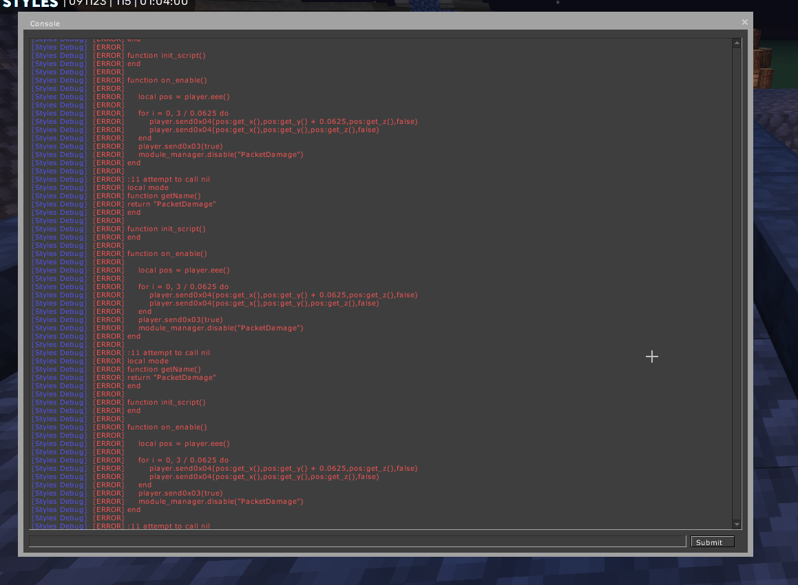
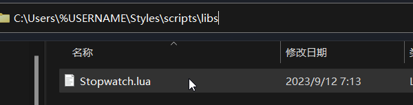

# 入门

## 加载脚本

首先找到你的客户端目录（通常在C:\Users\%USERNAME%\Styles\scripts，粘贴到文件资源管理器即可查看）里的scripts文件夹，将所有你需要安装的脚本放进去，找到Script页面的Relaod按钮，点击一下即可加载。


打开目录之后有一个script文件夹，内有一个libs文件夹

## 为 Styles 编写 lua 脚本的指南

### 代码编辑器

使用代码编辑器可以简化编辑过程，解决代码格式化问题，下面是一些推荐的代码编辑器，您可以选择任意一个进行编写。

|  编辑器   | 网站  |
|  ----  | ----  |
| VisualStudio Code  | [https://code.visualstudio.com/](https://code.visualstudio.com/) |
| Sublime Text  | [https://www.sublimetext.com/](https://www.sublimetext.com/) |
| Notepad++  | [https://notepad-plus-plus.org/](https://notepad-plus-plus.org/) |

如果您不熟悉Lua，我们建议您查看[Lua五分钟指南(汉化版)](lua.md)

### 调试

游戏中按下`GRAVE`可以打开调试控制台（再按一次即可关闭），所有脚本执行中出现的错误会在这个控制台输出


### 库

如果你需要使用任何Lua库，请把它放进脚本目录下的libs文件夹，例如[Stopwatch.lua](libs/lua库/stopwatch.md)



### 多模块脚本

从Styles b14开始，客户端支持添加多模块脚本，也就是一个lua中包含多个模块

模块之间使用split注释分割即可
```lua
-- @Split
```

示例，这个脚本会被注册为三个模块

```lua
function getName()
	return "Test1"
end

function init_script()
end

-- @Split

function getName()
	return "Test2"
end

function init_script()

end

-- @Split

function getName()
	return "Test3"
end

function init_script()

end
```