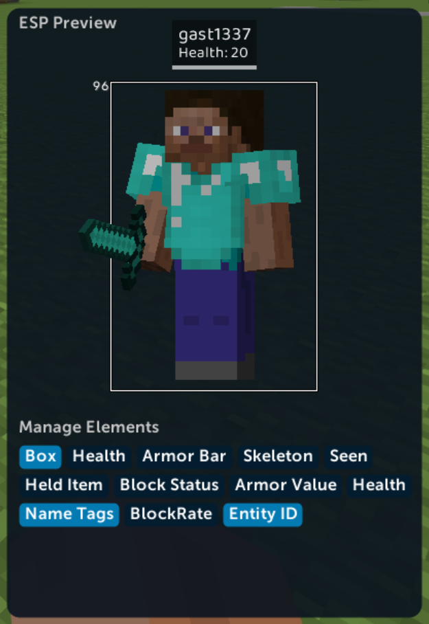
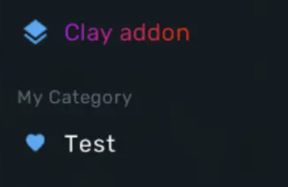

# client

### get_scoreboard_title
```lua
client.get_scoreboard_title() : string
```
获取计分板标题，如果没有计分板，则返回`NIL`

### get_scoreboard_lines
```lua
client.get_scoreboard_lines(boolean stripAliens) : string[]
```
获取计分板所有行的表，如果没有内容则返回空

???+ warning

    由于Hypixel开发小脑发育不完全大脑完全不发育，使用了愚蠢的的Emoji来排序计分板，所以直接读取会有一些煞笔emoji在上面，如果你希望移除这些煞笔emoji，参数stripAliens填写true，可能引起掉5帧左右，原版字体是渲染不了这些emoji的并不需要移除，如果是平滑字体则建议移除


### display_gui_screen
```lua
client.display_gui_screen()
```
打开当前Lua的GuiScreen，查看[Gui](../API/guievents.md)查看更多关于Gui的实现

### play_mc_sound
```lua
client.play_mc_sound(string sound, float pitch)
```
播放音效，参考`/playsound`指令

### register_draggable
```lua
client.register_draggable(string name, float width, float height, string render_function)
```
注册一个可拖动的HUD组件，渲染时会调用render_function，返回[Draggable](../objects/draggable.md)对象

示例：

```lua
local drag

function getName()
	return "Test2"
end

function init_script()
	drag = client.register_draggable("test",10,10,"render_test")
end

function render_test(partialTicks)
	// 此处渲染你的HUD控件
end
```

### register_esp_element
```lua
client.register_esp_element(string text_function, string color_function, string name, string direction)
```
注册一个文字ESP控件，第一个渲染参数传入EntityID
direction可以传入Left,Right,Bottom,Top四个字符串之一，即默认esp组件的方向
示例：
```lua
function init_script()
    client.register_esp_element("get_text","get_color","Entity ID","Left")
end

function get_color()
    return -1;
end

function get_text(entityId)
    return entityId;
end
```


### register_custom_esp_element
```lua
client.register_custom_esp_element(string render_function, string height_function, string name, string direction)
```
注册一个自定义渲染部分ESP，第一个渲染参数传入EntityID
irection可以传入Left,Right,Bottom,Top四个字符串之一，即默认esp组件的方向，**注意，渲染方法必须返回组件的宽度**
示例：
```
function init_script()
    client.register_custom_esp_element("render_esp","get_esp_height","MyElement","Left")
end

function render_esp(entityId,x,y)
    -- render stuff
    return 0; -- 返回组件宽度
end

function get_esp_height()
    return 10; -- 返回组件高度
end
```

### register_category
```lua
client.register_category(string name, string iconBase64, string parent) : Category
```
在clickgui注册一个模块类型，如果parent不存在则新建一个，返回[Category](../objects/category.md)

图片建议为48*48

示例:

```lua
client.register_category("Test","图片Base64","My Category")
```



### register_category_with_gradient
```lua
client.register_category_with_gradient(string name, string iconBase64, string parent, int color1, int color2) : Category
```

注册一个类似Matrix Yaw和Clay Addon的文字带有渐变效果的Category,返回[Category](../objects/category.md)

### register_command
```lua
client.register_command(string name, string[] aliases, string handler)
```
给客户端添加命令，handler为处理命令方法的名字，传入一个string tabel，示例：

```lua
function init_script()
    client.register_command("test1",{},"handle_test")
end

function handle_test (args)
    client.print("Hello")
end
```

输入.test1并发送后：


### rotation
```lua
client.rotation(float yaw,float pitch) : Rotation
```
创建[Rotation](../objects/rotation.md)对象

### nullCheck
```lua
client.nullCheck() : boolean
```
返回玩家是否在游戏中，也就是世界和玩家都不是Null

### time
```lua
client.time() : long
```
同`System.currentTimeMillis();`返回结果

### config
```lua
client.config() : string
```
返回当前客户端配置的名字

### fps
```lua
client.fps() : int
```
返回FPS

### print
```lua
client.print(string message)
```
在聊天栏打印信息

### start_blink
```lua
client.start_blink()
```
开始Blink

### stop_blink
```lua
client.stop_blink()
```
释放blink

### blinking
```lua
client.blinking() : boolean
```
返回是否在Blink