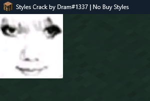
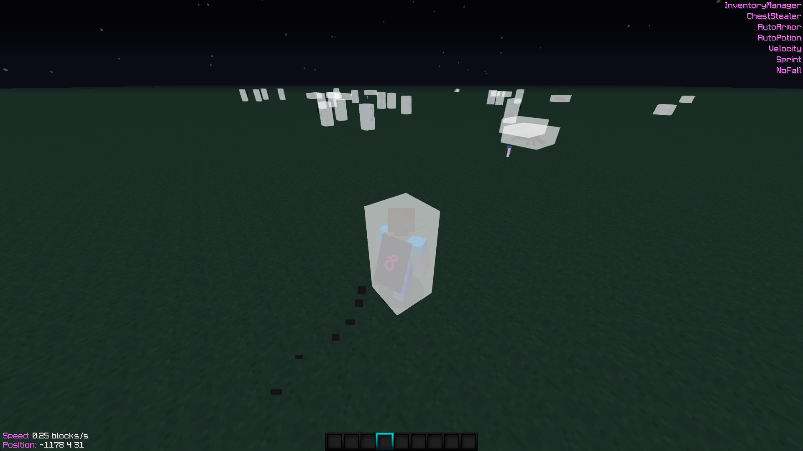
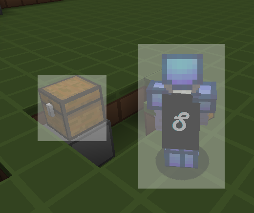

# render

MC字符串高度为9

### rect
```lua
render.rect(float x, float y, float width, float height, int rgb)
```
绘制矩形

### line
```lua
render.line(float x1, float y1, float x2, float y2, float width, int rgb)
```
绘制线

### image
```lua
render.image(string base64) : Image
```
生成图片对象，以[Image](../objects/image.md)的形式返回

[图片转Base64工具](https://c.runoob.com/front-end/59/)

`data:image/png;base64,`这个文字头是可选的，没有也不会影响渲染

示例：

```lua
function on_render_screen(event)
    local image = render.image("图片Base64")
    image:render(0,0,64,-1)
end
```



### get_delta
```lua
render.get_delta() : long
```
获取渲染增量

### string
```lua
render.string(string text, float x, float y, int rgb, boolean shadow)
```
绘制字符串，使用MC字体，也就是mc.fontRendererObj

### get_string_width
```lua
render.get_string_width(string text) : int
```
获取字符串宽度，使用MC字体，也就是mc.fontRendererObj

### draw_string
```lua
render.draw_string(string font, string text, float x, float y, int rgb, boolean shadow)
```
绘制字符串，使用平滑字体，支持的字体请查看[Fonts](../API/fonts.md)，示例：
```lua
render.draw_string("微软雅黑", "Hello World!", 1, 1, -1, false)
```

### string_width
```lua
render.string_width(string font, string text) : int
```
获取字符串宽度，使用平滑字体，支持的字体请查看[Fonts](../API/fonts.md)

### font_height
```lua
render.font_height(string font) : int
```
获取字体高度，使用平滑字体，支持的字体请查看[Fonts](../API/fonts.md)

### player_head
```lua
render.player_head(float x, float y, float size, int entityID)
```
绘制玩家大头

### round_player_head
```lua
render.round_player_head(float x, float y, float size, int entityID,float radius)
```
绘制玩家大头（圆角）

### draw_bounding_box
```lua
render.draw_bounding_box(int entityID, int color, int alpha)
```
绘制实体碰撞箱，示例：
```lua
function on_render_world()
    local list = world.entities()

    for i = 1, #list do
        local entindex = list[i]
        render.draw_bounding_box(entindex,-1,100)
    end
end
```



### world_to_screen
```lua
render.world_to_screen(int entityId) : Vector2D
```
将3D世界坐标转换为2D屏幕坐标，返回[Vector2D](../objects/vector2.md)

### block_world_to_screen
```lua
render.block_world_to_screen(BlockPos pos, string render_function)
```

### entity_world_to_screen
```lua
render.entity_world_to_screen(int entityId,string render_function)
```

这两个方法得到的回调函数参数均为`(double x, double y, double width, double height)`

### 示例

```lua
function on_render_screen(event)
    render.block_world_to_screen(player.create_position(0,4,0),"callback_method");
    render.entity_world_to_screen(player.id(),"callback_method");
end

function callback_method(x,y,w,h)
    render.rect(x,y,w,h,0x56FFFFFF);
end

```



### setup_camera_transform
```lua
render.setup_camera_transform(float partialTicks)
```
设置投影、视图效果、相机位置/转头渲染

### setup_overlay_rendering
```lua
render.setup_overlay_rendering()
```
为渲染 GUI 屏幕叠加设置正交投影。

### init_stencil
```lua
render.init_stencil()
```
初始化模板

### read_stencil
```lua
render.read_stencil()
```
在模板上绘制

### end_stencil
```lua
render.end_stencil()
```
结束模板

### item_stack
```lua
render.item_stack(ItemStack stack, float x, float y);
```
渲染物品到屏幕，第一个参数为[ItemStack](../objects/itemstack.md)