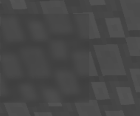

# shader

### push_blur
!!! note ""

    这个API玩家必须在hud中开启shader才能生效
```lua
shader.push_blur()
```
开始Blur绘制，必须在渲染线程使用，在使用pop_blur之前绘制的所有均为模糊的

### pop_blur
!!! note ""

    这个API玩家必须在hud中开启shader才能生效
```lua
shader.pop_blur(int radius)
```
停止Blur绘制

blur示例：
```lua
shader.push_blur()
render.rect(2.0, 12.0, 60.0, 60.0, -16777216)
shader.pop_blur(8)
```



### round_rect
```lua
shader.round_rect(float x, float y, float width, float height, int radius, int color)
```
绘制圆角矩形

### gradient_rect
```lua
shader.gradient_rect(float x, float y, float width, float height, int color, int color2)
```
绘制渐变矩形

### vertical_gradient_rect
```lua
shader.vertical_gradient_rect(float x, float y, float width, float height, int color, int color2)
```
绘制垂直渐变矩形

### push_gradient
```lua
shader.push_gradient(int bottomLeft, int topLeft, int bottomRight, int topRight)
```
开始渐变绘制，必须在渲染线程使用，在使用pop_gradient之前绘制的所有均为渐变的

### pop_gradient
```lua
shader.pop_gradient()
```
停止渐变绘制

### circle
```lua
shader.circle(float x, float y, float radius, float feather, int color, float diameter_width, int diameter_color)
```
绘制圆形
